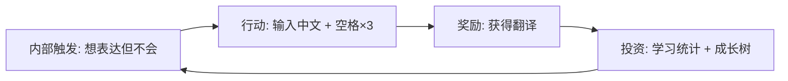

# English Output Learning 产品哲学分析报告

基于 **Product First Principles: Joy & Efficiency** 的 21 条法则，对产品现有功能和界面进行全面审计与优化建议。

---

## 📊 产品现状总览

### 核心功能矩阵

| 功能 | 触发方式 | 当前状态 | 哲学评分 |
|------|----------|----------|----------|
| 整句翻译 | 空格 × 3 | ✅ 已实现 | ⭐⭐⭐ |
| 单词翻译 | Ctrl + 空格 | ✅ 已实现 | ⭐⭐⭐⭐ |
| Ghost Text 显示 | 自动 | ✅ 已实现 | ⭐⭐⭐⭐ |
| Tab 补全 | Tab 键 | ✅ 已实现 | ⭐⭐⭐ |
| AI 写作辅导 | Tab (无虚字时) | ✅ 已实现 | ⭐⭐⭐⭐ |
| 学习统计 | Popup 首页 | ✅ 已实现 | ⭐⭐⭐ |
| 成长树动画 | 首页 | ✅ 已实现 | ⭐⭐⭐⭐ |
| 学习打卡海报 | 相机按钮 | ✅ 已实现 | ⭐⭐⭐ |

---

## 🔬 按法则逐项分析

### 1️⃣ 能量守恒法则 (Law of Energy Conservation)
> **「摩擦即痛苦」** - 每一次额外点击都是能量浪费

#### 现状评估
| 问题 | 严重程度 | 位置 |
|------|----------|------|
| 三次空格触发门槛过高 | 🟡 中 | `inputListener.ts` |
| Tab 补全默认关闭 | 🟡 中 | 设置页 |
| 帮助文档需手动查看 | 🟢 低 | Popup Help Tab |

#### 调整方案

##### HIGH PRIORITY - 降低翻译触发摩擦
```diff
# inputListener.ts
- 三次空格触发整句翻译
+ 方案C: 智能检测 - 中文 + 单次tap即触发
```

##### MEDIUM PRIORITY - 重新设计默认值
```diff
# config.ts
- tabAcceptsGhostText: false  // 默认关闭
+ tabAcceptsGhostText: true   // 默认开启，减少认知负担
```

> [!TIP]
> 「教育主义」与「效率主义」的平衡：可以保留"手动输入模式"作为可选项，但默认应该服务于效率。

---

### 2️⃣ 预测误差法则 (Law of Prediction Error)
> **「超越期望即快乐」** - 满足期望是中性的，超越才产生多巴胺

#### 现状评估
| 体验点 | 现状 | 惊喜度 |
|--------|------|--------|
| 翻译结果 | 纯文本展示 | 😐 中性 |
| Ghost Text | 灰色虚字 | 😐 中性 |
| AI 建议 | 弹窗列表 | 🙂 略正 |
| 成长树 | 有动画 | 😊 正向 |

#### 调整方案

##### HIGH PRIORITY - 翻译成功的"庆祝时刻"
```typescript
// GhostText.tsx - 新增成功动画
const renderSuccessAnimation = () => (
  <div className="ghost-success-burst">
    <span className="success-icon">✨</span>
    <span className="success-text">Perfect!</span>
    // 粒子特效 + 轻微震动反馈
  </div>
);
```

##### MEDIUM PRIORITY - AI 建议的惊喜升级
```diff
# ContextSuggestionModal.tsx
- 普通列表展示建议
+ 带有"地道程度评分"的建议卡片
+ 添加"Native Speaker 会这样说"徽章
+ 使用渐进式展示动画
```

##### LOW PRIORITY - Ghost Text 的视觉升级
```css
/* 从单调灰色 → 渐变高亮 */
.ghost-text {
  /* 旧样式 */
  color: rgba(255,255,255,0.3);
  
  /* 新样式 - 打字机效果 */
  background: linear-gradient(90deg, 
    var(--primary-500) 0%, 
    rgba(255,255,255,0.3) 50%
  );
  background-clip: text;
  animation: typewriter-glow 2s ease-in-out infinite;
}
```

---

### 3️⃣ 控制与能动性法则 (Law of Control & Agency)
> **「即时反馈验证存在」** - 高延迟断开输入与输出的联系

#### 现状评估
| 交互点 | 延迟 | 问题 |
|--------|------|------|
| 翻译响应 | ~500-2000ms | 🟡 可感知但可接受 |
| Ghost Text 更新 | <50ms | ✅ 优秀 |
| AI 建议 | ~1-3s | 🟡 需要 loading 状态 |
| 网络错误 | 有提示 | ✅ 良好 |

#### 调整方案

##### HIGH PRIORITY - 增强翻译等待体验
```typescript
// GhostText.tsx - 改进 loading 状态
const renderLoadingDots = () => (
  <div className="loading-skeleton">
    {/* 旧：三点跳动 */}
    {/* 新：骨架屏 + 预估长度 */}
    <span className="skeleton-text" style={{
      width: `${estimatedLength}ch`  // 根据输入长度预估
    }}>
      ████████  {/* 骨架占位 */}
    </span>
    <span className="loading-hint">正在翻译...</span>
  </div>
);
```

##### MEDIUM PRIORITY - 输入即时反馈强化
```typescript
// 打字时的微妙视觉反馈
const handleCorrectInput = () => {
  // 当用户正确输入 ghost text 中的字符时
  playSubtleHaptic();  // 轻触反馈（移动端）
  flashGreenUnderline(); // 绿色下划线闪烁
};
```

---

### 4️⃣ 负熵法则 (Law of Negative Entropy)
> **「清晰即平静」** - 混乱的 UI 增加认知熵

#### 现状评估

**Popup 界面结构分析**

```
┌─────────────────────────────────────┐
│ Header (Logo + Title + Share Button)│  ✅ 清晰
├─────────────────────────────────────┤
│ Growth Section (Tree + Word Count)  │  ✅ 突出
├─────────────────────────────────────┤
│ Stats Grid (2 cards)                │  ✅ 简洁
├─────────────────────────────────────┤
│ Recent Learning (List)              │  🟡 可优化
├─────────────────────────────────────┤
│ Quick Tips (Highlight Card)         │  ✅ 醒目
├─────────────────────────────────────┤
│ Bottom Nav (4 tabs)                 │  ✅ 标准
└─────────────────────────────────────┘
```

#### 调整方案

##### MEDIUM PRIORITY - 设置页简化
```diff
# App.tsx - 设置页结构优化
当前：所有设置项铺开显示
- 翻译服务选择
- API Key 输入（条件显示）
- AI 写作辅导开关
- Tab 补全开关
- 自定义动画 JSON

优化方案：
+ 基础设置（Always Visible）
  └─ 翻译服务选择
+ 高级设置（Collapsible）
  └─ API Key
  └─ AI 写作辅导
  └─ Tab 补全
+ 个性化（Collapsible）
  └─ 自定义动画
```

##### LOW PRIORITY - 帮助页层次优化
```diff
# 当前结构：4 个并列的 help-section
# 问题：信息密度过高，用户需要阅读全部内容

优化方案：
+ 可折叠的 FAQ 样式
+ 只展示标题，点击展开详情
+ 添加"常见问题"快速入口
```

---

### 5️⃣ 社交连接法则 (Law of Social Connection)
> **「被理解令人上瘾」** - 工具也能表现"社交性"

#### 现状评估
| 产品行为 | 社交感 | 评价 |
|----------|--------|------|
| 翻译结果 | 机械化 | 🟡 缺乏温度 |
| AI 建议 | 有 reason 字段 | 🙂 有一定温度 |
| 错误提示 | "网络错误" | 😐 冷淡 |
| 成功反馈 | 无 | 😐 缺失 |

#### 调整方案

##### HIGH PRIORITY - 拟人化反馈语言
```typescript
// 替换冷冰冰的系统消息
const EMPATHETIC_MESSAGES = {
  networkError: {
    old: "网络错误",
    new: "网络开小差了，再试一次？🤷‍♂️"
  },
  noSuggestion: {
    old: "无建议",
    new: "表达很棒！继续保持 ✨"
  },
  translationSuccess: {
    old: (无),
    new: "这个表达很地道！👍"
  },
  learningMilestone: {
    old: (无),
    new: "今天已学习 50 个单词！你真棒！🎉"
  }
};
```

##### MEDIUM PRIORITY - AI 建议的"对话感"
```diff
# llm.ts - 优化 prompt
- "请检查以下句子的语法错误"
+ "作为一位友好的英语老师，请帮助学生改进以下表达"

# ContextSuggestionModal.tsx - 展示方式
- 干巴巴的 "reason: 语法错误"
+ 亲切的 "💡 小贴士：这里用 'have been' 会更自然哦"
```

---

### 6️⃣ 心流法则 (Law of Flow)
> **「挑战与技能平衡」** - 太难焦虑，太简单无聊

#### 现状评估
| 用户水平 | 产品支持 | 评价 |
|----------|----------|------|
| 初学者 | Ghost Text 全文展示 | 🟡 可能过于依赖 |
| 中级者 | 无进阶模式 | 🟡 缺乏挑战 |
| 高级者 | AI 建议 | ✅ 适合 |

#### 调整方案

##### HIGH PRIORITY - 难度分级系统
```typescript
// 新增学习模式设置
interface LearningMode {
  level: 'beginner' | 'intermediate' | 'advanced';
  ghostTextReveal: 'full' | 'partial' | 'none';
  hintDelay: number;  // ms
  encourageHandWriting: boolean;
}

const LEARNING_MODES = {
  beginner: {
    ghostTextReveal: 'full',      // 显示完整虚字
    hintDelay: 0,                 // 立即显示
    encourageHandWriting: false   // 允许直接 Tab 补全
  },
  intermediate: {
    ghostTextReveal: 'partial',   // 只显示首字母提示
    hintDelay: 1000,              // 延迟 1 秒
    encourageHandWriting: true    // 鼓励手写
  },
  advanced: {
    ghostTextReveal: 'none',      // 不显示虚字
    hintDelay: 3000,              // 思考 3 秒后才显示
    encourageHandWriting: true    // 强制手写
  }
};
```

##### MEDIUM PRIORITY - 自适应难度调整
```typescript
// 根据用户表现动态调整
const adjustDifficulty = (userPerformance: UserStats) => {
  const { correctRate, avgTypingSpeed, useTabRatio } = userPerformance;
  
  if (correctRate > 0.9 && avgTypingSpeed > 60) {
    return suggestLevelUp();  // "你已经很熟练了，要不要挑战更高难度？"
  }
  if (correctRate < 0.5 || useTabRatio > 0.8) {
    return suggestLevelDown();  // "别着急，我们放慢一点"
  }
};
```

---

### 7️⃣ 审美-可用性效应 (Aesthetic-Usability Effect)
> **「美即功能」** - 丑陋的界面被潜意识拒绝

#### 现状评估

**视觉设计评分**

| 元素 | 评分 | 优点 | 不足 |
|------|------|------|------|
| 配色 | ⭐⭐⭐⭐ | 深色主题协调 | 色彩层次可丰富 |
| 排版 | ⭐⭐⭐⭐ | Inter 字体专业 | - |
| 动画 | ⭐⭐⭐ | 成长树有动效 | 其他交互动画不足 |
| 图标 | ⭐⭐⭐⭐ | SVG 手绘风格统一 | - |
| 间距 | ⭐⭐⭐⭐ | 呼吸感良好 | - |

#### 调整方案

##### MEDIUM PRIORITY - 微交互动画增强
```css
/* 按钮点击涟漪效果 */
.nav-btn::after {
  content: '';
  position: absolute;
  inset: 0;
  background: radial-gradient(
    circle at var(--click-x) var(--click-y),
    rgba(255,255,255,0.3) 0%,
    transparent 60%
  );
  opacity: 0;
  transition: opacity 0.3s;
}

.nav-btn:active::after {
  opacity: 1;
  animation: ripple 0.4s ease-out;
}

/* 卡片悬停效果增强 */
.stat-card {
  transition: all 200ms cubic-bezier(0.34, 1.56, 0.64, 1);
}

.stat-card:hover {
  transform: translateY(-4px) scale(1.02);
  box-shadow: 0 12px 24px rgba(0,0,0,0.2);
}
```

##### LOW PRIORITY - Ghost Text 视觉升级
```css
/* 打字机光标效果 */
.ghost-text::after {
  content: '|';
  animation: blink 1s step-end infinite;
  color: var(--primary-500);
}

@keyframes blink {
  50% { opacity: 0; }
}
```

---

### 8️⃣ 习惯形成法则 (Law of Habit Formation)
> **「成为条件反射」** - Hook Model: 触发 → 行动 → 奖励 → 投资

#### 现状评估



| Hook 阶段 | 现状 | 评价 |
|-----------|------|------|
| 触发 (Trigger) | 需要手动想起 | 🟡 被动 |
| 行动 (Action) | 3次空格 | 🟡 摩擦较高 |
| 奖励 (Reward) | 翻译结果 | ✅ 明确 |
| 投资 (Investment) | 学习统计 | 🟡 缺乏即时可见性 |

#### 调整方案

##### HIGH PRIORITY - 强化奖励机制
```typescript
// 新增即时奖励系统
interface InstantReward {
  type: 'streak' | 'milestone' | 'perfectInput' | 'newWord';
  message: string;
  animation: 'confetti' | 'sparkle' | 'levelUp';
}

const REWARD_TRIGGERS = {
  // 连续正确输入 5 个单词
  perfectStreak: { count: 5, reward: '🔥 连击！' },
  // 学习新单词
  newWord: { reward: '📚 新单词 get！' },
  // 每日首次使用
  dailyFirstUse: { reward: '早起的鸟儿有虫吃！☀️' },
  // 达成里程碑
  milestone: { 
    10: '🌱 种子发芽',
    50: '🌿 小树成长',
    100: '🌳 大树参天'
  }
};
```

##### MEDIUM PRIORITY - 增强投资粘性
```diff
# Popup 首页 - 增加"投资"可见性
+ 显示"学习进度条"（本周目标: 100 words）
+ 显示"学习火焰"连续登录天数
+ 显示"成就徽章"收集进度
```

---

### 9️⃣ 峰终法则 (Peak-End Rule)
> **「高光时刻 + 完美收尾」** - 人们记住的是峰值和结尾

#### 现状评估
| 体验点 | 是否有"峰值" | 是否有"收尾" |
|--------|-------------|-------------|
| 翻译成功 | ❌ 无特别反馈 | ❌ 无 |
| AI 建议采纳 | ✅ 有确认动画 | ✅ 弹窗关闭 |
| 每日学习完成 | ❌ 无里程碑反馈 | ❌ 无 |

#### 调整方案

##### HIGH PRIORITY - 创造"峰值时刻"
```typescript
// 当用户连续正确输入完整 Ghost Text 时
const celebratePerfectInput = () => {
  // 1. 文字爆发效果
  triggerConfetti({ particleCount: 50, origin: 'cursor' });
  
  // 2. 音效反馈（可选）
  playSuccessSound();
  
  // 3. 临时成就弹窗
  showMicroAchievement('完美输入！', 'perfect_input');
};

// 当用户达成每日目标时
const celebrateDailyGoal = () => {
  showModal({
    type: 'celebration',
    title: '🎉 今日目标达成！',
    content: `你已学习 ${todayWords} 个单词`,
    animation: 'fireworks',
    shareOption: true  // 提供分享按钮
  });
};
```

##### MEDIUM PRIORITY - 完美收尾设计
```typescript
// 当用户关闭插件时
const onPopupClose = () => {
  if (todayActivity > 0) {
    showToast('明天见！坚持就是胜利 💪');
  }
};

// 当用户完成一次学习会话时
const onSessionEnd = () => {
  showSummary({
    wordsLearned: session.words,
    timeSpent: session.duration,
    improvement: calculateImprovement()
  });
};
```

---

### 🔟 成长法则 (Law of Growth)
> **「不仅修复，更要教导」** - 依赖产生习惯，成长产生忠诚

#### 现状评估
| 功能 | 教学价值 | 评价 |
|------|----------|------|
| Ghost Text | 被动模仿 | 🟡 不够主动 |
| AI 建议 reason 字段 | 有解释 | ✅ 好 |
| 学习统计 | 纯数字 | 🟡 缺乏洞察 |

#### 调整方案

##### HIGH PRIORITY - 学习洞察系统
```typescript
// 新增学习分析功能
interface LearningInsight {
  // 常见错误类型分析
  commonMistakes: {
    type: 'grammar' | 'vocabulary' | 'expression';
    examples: string[];
    suggestion: string;
  }[];
  
  // 词汇增长曲线
  vocabularyGrowth: {
    thisWeek: number;
    lastWeek: number;
    trend: 'up' | 'down' | 'stable';
  };
  
  // 个性化建议
  recommendation: string;
}

// 在 Popup 首页添加"学习洞察"卡片
const LearningInsightCard = () => (
  <div className="insight-card">
    <h3>📈 本周学习洞察</h3>
    <p>你最常犯的错误是：<strong>时态使用</strong></p>
    <p>建议：多注意过去式和现在完成时的区别</p>
    <button>查看详细分析</button>
  </div>
);
```

##### MEDIUM PRIORITY - 知识点关联
```diff
# AI 建议 - 增强教学维度
当前: { original, suggested, reason }
优化:
+ relatedGrammar: string;     // "参见: 现在完成时用法"
+ similarExamples: string[];   // 类似表达示例
+ practiceLink: string;        // 练习链接（可选）
```

---

### 1️⃣1️⃣ 认知负荷法则 (Law of Cognitive Load)
> **「少即是多」** - 每一个额外选项都稀释了正确选项的重要性

#### 现状评估

**设置页选项数量：6 个**
- 翻译服务 (必选)
- DeepSeek API Key (条件)
- GLM API Key (条件)
- AI 写作辅导 (开关)
- Tab 补全 (开关)
- 自定义动画 (可选)

**评价**：选项数量适中，但可以进一步简化首次体验

#### 调整方案

##### MEDIUM PRIORITY - 渐进式设置展示
```typescript
// 首次使用只显示核心设置
const SettingsPanel = () => {
  const [showAdvanced, setShowAdvanced] = useState(false);
  
  return (
    <>
      {/* 核心设置 - Always Visible */}
      <ServiceSelector />
      
      {/* 高级设置 - Collapsible */}
      <Collapsible 
        title="高级设置" 
        open={showAdvanced}
        onChange={setShowAdvanced}
      >
        <AIWritingToggle />
        <TabCompletionToggle />
        <CustomAnimationInput />
      </Collapsible>
    </>
  );
};
```

##### LOW PRIORITY - 智能默认值
```typescript
// 根据用户行为自动调整设置
const autoConfigureSettings = (usage: UserUsage) => {
  // 如果用户频繁使用 Tab 补全
  if (usage.tabUsageRate > 0.6) {
    suggestEnabling('tabAcceptsGhostText');
  }
  
  // 如果用户经常使用 AI 服务
  if (usage.hasApiKey && usage.aiSuggestionAdoptRate > 0.5) {
    suggestEnabling('aiWritingAssistant');
  }
};
```

---

### 1️⃣2️⃣ 信任法则 (Law of Trust)
> **「一致性为王」** - 宁可不给建议，也不给错建议

#### 现状评估
| 可靠性维度 | 现状 | 评价 |
|------------|------|------|
| 翻译准确性 | 取决于服务商 | 🟡 不可控 |
| AI 建议质量 | 有时过度纠正 | 🟡 需要校准 |
| 数据安全 | `chrome.storage` | ✅ 良好 |
| 配置持久化 | 有保存机制 | ✅ 良好 |

#### 调整方案

##### HIGH PRIORITY - AI 建议质量校准
```typescript
// llm.ts - 增加置信度阈值
interface SuggestionWithConfidence extends WritingSuggestion {
  confidence: number;  // 0-1
}

const filterLowConfidenceSuggestions = (
  suggestions: SuggestionWithConfidence[]
) => {
  // 只展示高置信度建议（> 0.7）
  return suggestions.filter(s => s.confidence > 0.7);
};

// 优化 prompt - 减少过度纠正
const WRITING_QUALITY_PROMPT = `
You are a helpful English writing assistant.
IMPORTANT GUIDELINES:
1. Only suggest changes that significantly improve the text
2. Do NOT suggest changes for already correct sentences
3. Prefer common expressions over unnecessarily formal ones
4. If the text is acceptable, return NO suggestions
`;
```

##### MEDIUM PRIORITY - 用户反馈机制
```typescript
// 允许用户对建议进行反馈
const SuggestionCard = ({ suggestion }) => (
  <div className="suggestion-card">
    {/* ... 建议内容 ... */}
    <div className="feedback-buttons">
      <button onClick={() => feedback('helpful')}>👍 有帮助</button>
      <button onClick={() => feedback('not-helpful')}>👎 不太对</button>
    </div>
  </div>
);

// 收集反馈用于后续改进
const collectFeedback = (suggestionId: string, isHelpful: boolean) => {
  // 存储到 chrome.storage 用于分析
  saveFeedback({ suggestionId, isHelpful, timestamp: Date.now() });
};
```

---

### 1️⃣3️⃣ 损失厌恶法则 (Law of Loss Aversion)
> **「安全第一」** - 丢失用户数据是灾难性失败

#### 现状评估
| 数据类型 | 保护机制 | 评价 |
|----------|----------|------|
| 学习记录 | `chrome.storage.local` | ✅ 持久化 |
| 配置 | `chrome.storage.sync` | ✅ 跨设备同步 |
| 输入内容 | 无备份 | 🟡 可能丢失 |
| 正在进行的翻译 | 无保护 | 🟡 可能丢失 |

#### 调整方案

##### MEDIUM PRIORITY - 输入状态保护
```typescript
// 在翻译过程中保护用户输入
const protectUserInput = (input: string, target: HTMLElement) => {
  // 保存原始输入到 sessionStorage
  sessionStorage.setItem('eol_last_input', JSON.stringify({
    text: input,
    timestamp: Date.now(),
    targetId: getElementId(target)
  }));
};

// 恢复机制
const recoverInput = () => {
  const saved = sessionStorage.getItem('eol_last_input');
  if (saved) {
    const { text, timestamp } = JSON.parse(saved);
    // 如果是最近 5 分钟内的输入，提供恢复选项
    if (Date.now() - timestamp < 5 * 60 * 1000) {
      showRecoveryOption(text);
    }
  }
};
```

##### LOW PRIORITY - 学习数据导出
```typescript
// 允许用户导出学习记录
const exportLearningData = async () => {
  const stats = await getTranslationStats();
  const data = JSON.stringify(stats, null, 2);
  downloadAsFile(data, `eol-learning-${Date.now()}.json`);
};
```

---

### 1️⃣4️⃣ 默认值法则 (Law of Default)
> **「默认即命运」** - 95% 的用户不会更改设置

#### 现状评估
| 设置项 | 当前默认值 | 是否最优 |
|--------|-----------|----------|
| translationService | `google` | ✅ 对（免费易用）|
| tabAcceptsGhostText | `false` | 🟡 可讨论 |
| aiWritingAssistant | `false` | ✅ 对（需要 API）|

#### 调整方案

##### MEDIUM PRIORITY - 重新评估默认值
```diff
# config.ts - 优化默认配置

// 翻译服务 - 保持 Google（免费门槛最低）
translationService: 'google' ✅

// Tab 补全 - 建议改为 true
- tabAcceptsGhostText: false
+ tabAcceptsGhostText: true  // 大多数用户期望这个行为

// AI 写作辅导 - 保持 false（需要 API Key）
aiWritingAssistant: false ✅

// 新增：首次使用引导
+ showOnboarding: true
+ onboardingCompleted: false
```

##### HIGH PRIORITY - 首次使用引导
```typescript
const Onboarding = () => {
  const [step, setStep] = useState(1);
  
  return (
    <Modal>
      {step === 1 && (
        <div>
          <h2>👋 欢迎使用 English Output Learning!</h2>
          <p>只需 30 秒完成设置</p>
          <button onClick={() => setStep(2)}>开始</button>
        </div>
      )}
      {step === 2 && (
        <div>
          <h2>选择翻译服务</h2>
          <ServiceSelector />
          <button onClick={() => setStep(3)}>下一步</button>
        </div>
      )}
      {step === 3 && (
        <div>
          <h2>🎉 设置完成！</h2>
          <QuickTipsDemo />  {/* 动画演示核心功能 */}
          <button onClick={finishOnboarding}>开始学习</button>
        </div>
      )}
    </Modal>
  );
};
```

---

### 1️⃣5️⃣ 信噪比法则 (Law of Signal-to-Noise)
> **「相关即尊重」** - 展示 5 个建议而只有 1 个完美的 = 噪音

#### 现状评估

**AI 建议展示**
- 当前：展示所有检测到的建议
- 问题：可能包含低价值或重复建议

#### 调整方案

##### HIGH PRIORITY - 建议过滤与排序
```typescript
// llm.ts - 增强去重和过滤逻辑
const filterAndRankSuggestions = (
  suggestions: WritingSuggestion[]
): WritingSuggestion[] => {
  // 1. 去重（已有 deduplicateSuggestions）
  let filtered = deduplicateSuggestions(suggestions);
  
  // 2. 按重要性排序
  filtered.sort((a, b) => {
    // 语法错误 > 词汇选择 > 风格建议
    const priorityOrder = { grammar: 3, vocabulary: 2, style: 1 };
    return priorityOrder[b.type] - priorityOrder[a.type];
  });
  
  // 3. 限制数量（最多 3 个）
  return filtered.slice(0, 3);
};
```

##### MEDIUM PRIORITY - 建议展示优化
```typescript
// ContextSuggestionModal.tsx
const SuggestionList = ({ suggestions }) => {
  // 如果只有 1 个建议，直接展示详情
  if (suggestions.length === 1) {
    return <DetailedSuggestion suggestion={suggestions[0]} />;
  }
  
  // 多个建议使用精简列表 + 展开详情
  return (
    <ul>
      {suggestions.map(s => (
        <li key={s.id}>
          <SummaryLine>{s.original} → {s.suggested}</SummaryLine>
          <ExpandButton onClick={() => expand(s.id)} />
        </li>
      ))}
    </ul>
  );
};
```

---

### 1️⃣6️⃣ 帕累托法则 (Pareto Principle)
> **「80/20 法则」** - 用户使用 20% 功能占 80% 时间

#### 现状评估

**功能使用频率预估**

| 功能 | 预估使用频率 | 优先级 |
|------|-------------|--------|
| 整句翻译 (空格×3) | 60% | 🔴 核心 |
| Ghost Text 输入 | 25% | 🔴 核心 |
| 单词翻译 (Ctrl+空格) | 10% | 🟡 重要 |
| AI 写作辅导 | 3% | 🟢 增值 |
| 学习统计 | 2% | 🟢 增值 |

#### 调整方案

##### HIGH PRIORITY - 核心功能极致打磨
```diff
# 核心功能（80% 精力）
翻译触发体验:
+ 降低触发门槛（2空格 or 智能检测）
+ 加速翻译响应（缓存常见翻译）
+ 优化 Ghost Text 渲染性能

Ghost Text 输入体验:
+ 即时字符匹配反馈
+ 容错机制（忽略大小写/标点差异）
+ 平滑的视觉过渡动画
```

##### LOW PRIORITY - 增值功能适度投入
```diff
# 增值功能（20% 精力）
- 避免在 AI 辅导上过度投入（用户使用率低）
- 学习统计页面保持简洁
- 自定义动画作为"彩蛋"功能
```

---

### 1️⃣7️⃣ IKEA 效应 (IKEA Effect)
> **「参与创造忠诚」** - 用户参与构建的东西更有价值

#### 现状评估
| 个性化功能 | 现状 | 评价 |
|------------|------|------|
| 自定义动画 | ✅ 有 | 门槛高，少数人用 |
| 学习记录 | ✅ 有 | 被动积累 |
| 自定义词库 | ❌ 无 | 缺失重要功能 |

#### 调整方案

##### MEDIUM PRIORITY - 个人词库功能
```typescript
// 新增个人词库
interface PersonalVocabulary {
  word: string;
  translation: string;
  context: string;
  learnedAt: Date;
  reviewCount: number;
  mastery: 0 | 1 | 2 | 3;  // 未学 → 熟练
}

// 允许用户标记"需要复习"的单词
const MarkForReview = ({ word, translation }) => (
  <button 
    onClick={() => addToPersonalVocab(word, translation)}
    title="添加到我的词库"
  >
    ⭐
  </button>
);

// 在首页展示"今日复习"
const TodayReview = () => {
  const wordsToReview = getWordsForReview();
  return (
    <div className="review-section">
      <h3>📖 今日复习 ({wordsToReview.length})</h3>
      <FlashCardCarousel words={wordsToReview} />
    </div>
  );
};
```

##### LOW PRIORITY - 成就系统
```typescript
const ACHIEVEMENTS = [
  { id: 'first_translation', name: '开始启程', condition: 'translations >= 1' },
  { id: 'streak_7', name: '一周坚持', condition: 'streakDays >= 7' },
  { id: 'words_100', name: '词汇达人', condition: 'totalWords >= 100' },
  { id: 'no_tab_day', name: '硬核模式', condition: 'noTabUsageInDay' },
  // ...
];
```

---

### 1️⃣8️⃣ 最小惊讶原则 (Principle of Least Astonishment)
> **「无聊是好的」** - 标准元素用标准方式

#### 现状评估
| 行为 | 是否符合预期 | 评价 |
|------|-------------|------|
| Esc 关闭弹窗 | ✅ 符合 | |
| Tab 补全 | ✅ 符合（如开启） | |
| 空格×3 触发 | 🟡 非标准 | 需要学习 |
| Ctrl+空格 | 🟡 与输入法冲突 | 可能问题 |

#### 调整方案

##### MEDIUM PRIORITY - 减少与系统快捷键冲突
```typescript
// 检测并提示快捷键冲突
const detectShortcutConflict = () => {
  // 检测系统输入法切换快捷键
  if (isChineseIME() && shortcut === 'Ctrl+Space') {
    showWarning('Ctrl+空格可能与输入法冲突，建议在中文输入法下使用其他触发方式');
    suggestAlternative('Ctrl+Enter');
  }
};

// 可配置的快捷键
interface ShortcutConfig {
  translateSentence: string[];  // ['Space', 'Space', 'Space']
  translateWord: string;        // 'Ctrl+Space' or 'Ctrl+Enter'
  acceptGhost: string;          // 'Tab'
  triggerAICoach: string;       // 'Tab' (when no ghost)
}
```

---

### 1️⃣9️⃣ 互惠法则 (Law of Reciprocity)
> **「先给予价值，再索取」** - 体验魔法后再要求行动

#### 现状评估
| 场景 | 当前做法 | 评价 |
|------|----------|------|
| 首次使用 | 直接展示设置 | 🟡 可优化 |
| 使用 API 服务 | 需要先配置 Key | 🟡 门槛高 |
| 评价请求 | 无 | - |

#### 调整方案

##### HIGH PRIORITY - 先体验后设置
```typescript
// 新用户流程优化
const newUserFlow = async () => {
  // Step 1: 立即可用（Google 翻译免费）
  // 无需任何配置即可开始使用核心功能
  
  // Step 2: 体验 10 次翻译后
  if (translationCount >= 10) {
    showSuggestion('解锁 AI 辅导功能？配置 API Key 获得更智能的写作建议');
  }
  
  // Step 3: 使用一周后
  if (usageDays >= 7) {
    showRequest('喜欢这个扩展吗？给个好评支持一下 ⭐');
  }
};
```

##### LOW PRIORITY - 试用 API 服务
```typescript
// 提供有限的免费 AI 辅导体验
const FREE_AI_TRIAL = {
  enabled: true,
  dailyLimit: 3,  // 每天 3 次免费 AI 辅导
  message: '今日免费 AI 辅导已用完，配置自己的 API Key 可无限使用'
};
```

---

### 2️⃣0️⃣ 蔡格尼克效应 (Zeigarnik Effect)
> **「未完成的任务令人记忆犹新」** - 利用进度条驱动行为

#### 现状评估
| 进度可视化 | 现状 | 评价 |
|------------|------|------|
| 每日目标 | ❌ 无 | 缺失关键驱动力 |
| 学习连续性 | ✅ 连续天数 | 仅数字展示 |
| 成长可视化 | ✅ 成长树 | 优秀 |

#### 调整方案

##### HIGH PRIORITY - 每日目标系统
```typescript
// 新增每日目标设置
interface DailyGoal {
  targetWords: number;  // 默认 20
  currentWords: number;
  progress: number;     // 0-100
}

// 首页进度环
const DailyProgress = ({ goal }: { goal: DailyGoal }) => (
  <div className="daily-progress">
    <CircularProgress value={goal.progress} />
    <span>{goal.currentWords} / {goal.targetWords} 单词</span>
    {goal.progress < 100 && (
      <span className="encouragement">
        再学 {goal.targetWords - goal.currentWords} 个！
      </span>
    )}
  </div>
);
```

##### MEDIUM PRIORITY - 周/月目标
```typescript
const WeeklyChallenge = () => {
  const weeklyProgress = calculateWeeklyProgress();
  
  return (
    <div className="weekly-challenge">
      <ProgressBar value={weeklyProgress} />
      <span>本周目标: 完成 5 天学习</span>
      <div className="day-dots">
        {[1,2,3,4,5].map(day => (
          <Dot key={day} filled={completedDays.includes(day)} />
        ))}
      </div>
    </div>
  );
};
```

---

### 2️⃣1️⃣ 相对性法则 (Law of Relativity)
> **「比替代品更好」** - 我们在与替代方案竞争

#### 现状评估

**竞品对比**

| 维度 | 我们 | Google 翻译 | DeepL | 其他插件 |
|------|------|-------------|-------|----------|
| 翻译速度 | ⭐⭐⭐ | ⭐⭐⭐⭐⭐ | ⭐⭐⭐⭐ | ⭐⭐ |
| 学习价值 | ⭐⭐⭐⭐⭐ | ⭐ | ⭐ | ⭐⭐ |
| 易用性 | ⭐⭐⭐ | ⭐⭐⭐⭐ | ⭐⭐⭐⭐ | ⭐⭐ |
| 集成度 | ⭐⭐⭐⭐⭐ | ⭐⭐ | ⭐⭐ | ⭐⭐⭐ |

**我们的核心差异化**：**学习导向**而非纯翻译工具

#### 调整方案

##### HIGH PRIORITY - 强化差异化优势
```diff
# 产品定位强化
- 当前："翻译工具 + 学习统计"
+ 目标："主动式英语输出训练器"

核心卖点重塑:
+ "不只是翻译，更是你的英语教练"
+ "每次使用都在进步"
+ "从 Chinglish 到地道表达"
```

##### MEDIUM PRIORITY - 对比展示
```typescript
// 在 Popup 首页展示成就与竞品对比
const ComparisonCard = () => (
  <div className="comparison-card">
    <h3>🎯 如果用传统翻译...</h3>
    <p>你需要手动复制粘贴 <strong>{totalTranslations * 2}</strong> 次</p>
    <p>English Output Learning 帮你节省了 <strong>{timeSaved}</strong> 分钟</p>
    <p>并且学到了 <strong>{uniqueWords}</strong> 个新单词！</p>
  </div>
);
```

---

## 🎯 优化方案优先级矩阵

| 影响 ↓ / 实现成本 → | 低成本 (< 1天) | 中成本 (1-3天) | 高成本 (> 3天) |
|---------------------|----------------|----------------|----------------|
| **高影响** | ① 翻译触发门槛降低<br>② 默认设置优化<br>③ 成功反馈动画 | ④ 首次使用引导<br>⑤ 每日目标系统<br>⑥ AI 建议质量校准 | ⑦ 难度分级系统<br>⑧ 个人词库功能 |
| **中影响** | ⑨ 拟人化反馈语言<br>⑩ 设置页分组 | ⑪ 学习洞察系统<br>⑫ 用户反馈机制 | ⑬ 成就系统 |
| **低影响** | ⑭ 微交互动画<br>⑮ 帮助页FAQ化 | ⑯ 输入状态保护<br>⑰ 数据导出 | ⑱ 自适应难度 |

---

## 🚀 建议实施路线图

### Phase 1: Quick Wins (本周)
- [x] 分析产品现状 ✅
- [ ] ① 评估翻译触发机制优化方案
- [ ] ② 调整默认设置
- [ ] ③ 添加翻译成功反馈动画
- [ ] ⑨ 更新反馈语言为拟人化

### Phase 2: Core Experience (2周)
- [ ] ④ 实现首次使用引导
- [ ] ⑤ 添加每日目标进度环
- [ ] ⑥ 优化 AI 建议 prompt 和过滤逻辑
- [ ] ⑩ 设置页分组折叠

### Phase 3: Growth Features (1月)
- [ ] ⑦ 难度分级系统
- [ ] ⑧ 个人词库 MVP
- [ ] ⑪ 学习洞察卡片
- [ ] ⑫ 建议反馈机制

### Phase 4: Delight & Polish (持续)
- [ ] ⑬ 成就系统
- [ ] ⑭ 全局微交互动画升级
- [ ] 其他细节优化

---

> [!IMPORTANT]
> **核心原则回顾**
> 
> 所有优化都应服务于一个目标：**让用户感到强大、聪明、轻松 (Powerful, Smart, and at Ease)**。
> 
> 每次修改前问自己：这个改动会让用户更快乐吗？

---

*本文档基于 product-philosophy-master 技能的 21 条法则，对 English Output Learning 扩展进行的全面审计。建议结合团队资源和用户反馈，按优先级逐步实施。*
